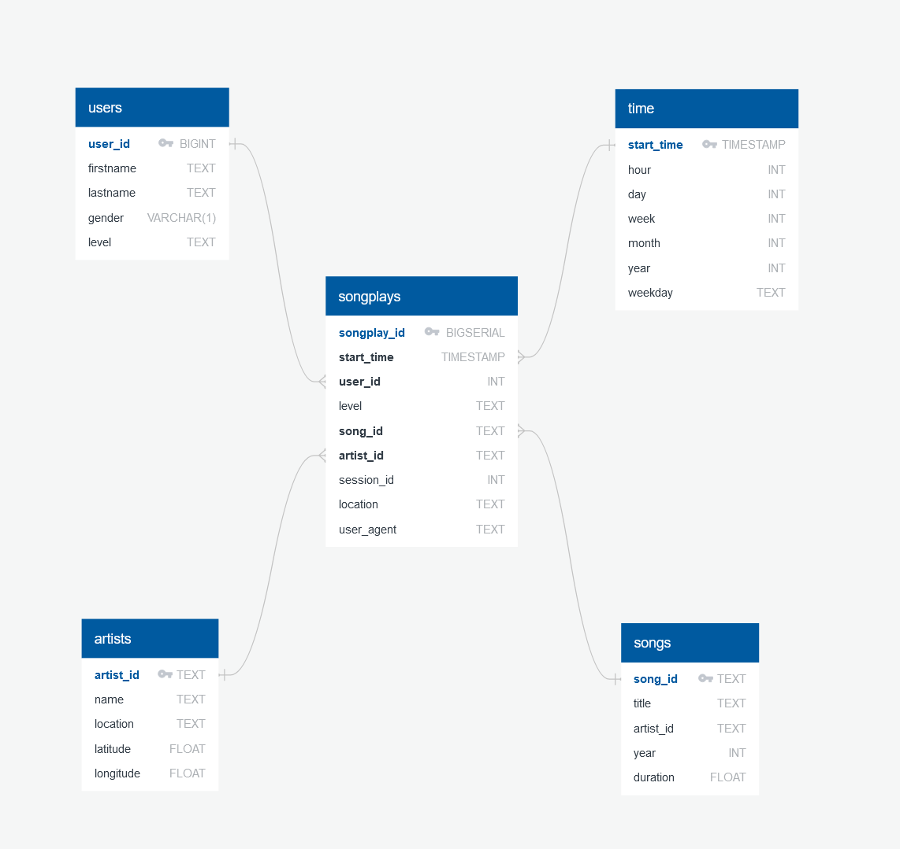

# Sparkify Postgres ETL (Udacity Nanodegree - Data Engineering Path)

## Project: Data Modeling with Postgres

### Context 

A startup called Sparkify wants to analyze the data they've been collecting on songs and user activity on their new music streaming app. The analytics team is particularly interested in understanding what songs users are listening to. Currently, they don't have an easy way to query their data, which resides in a directory of JSON logs on user activity on the app, as well as a directory with JSON metadata on the songs in their app.

They'd like a data engineer to create a Postgres database with tables designed to optimize queries on song play analysis, and bring you on the project. Your role is to create a database schema and ETL pipeline for this analysis. You'll be able to test your database and ETL pipeline by running queries given to you by the analytics team from Sparkify and compare your results with their expected results.

### Project Description
In this project, you'll apply what you've learned on data modeling with Postgres and build an ETL pipeline using Python. To complete the project, you will need to define fact and dimension tables for a star schema for a particular analytic focus, and write an ETL pipeline that transfers data from files in two local directories into these tables in Postgres using Python and SQL.

### Data Model

I have implemented star schema. It is the typical schema for a Data Warehouse and together with the snowflake model they are the most popular data warehouse schemas. In our scenario "songplays" will be fact table. Rest of the tables will be dimension tables.

#### Below there is a diagram for implemented Data Warehouse:

#### Below there is a descriptions for implemented Data Warehouse tables:

#### Fact tables:
- ___songplays___ - records in log data associated with song plays i.e. records with page NextSong
    - songplay_id (BIGINT, PRIMARY KEY)
    - start_time (TIMESTAMP, NOT NULL, FK)
    - user_id (BIGINT, NOT NULL, FK)
    - level (TEXT)
    - song_id (TEXT, FK)
    - artist_id (TEXT, FK)
    - session_id (INT, NOT NULL)
    - location (TEXT)
    - user_agent (TEXT)
    
#### Dimension tables:
- ___users___ - users in the app
    - user_id (BIGINT, PRIMARY KEY)
    - firstname (TEXT, NOT NULL)
    - lastname (TEXT, NOT NULL)
    - gender (VARCHAR(1))
    - level (TEXT, NOT NUL)
    
    
- ___songs___ - songs in music database
    - song_id (TEXT, PRIMARY KEY)
    - title (TEXT, NOT NULL)
    - artist_id (TEXT, NOT NULL)
    - year (INT, NOT NULL)
    - duration (FLOAT, NOT NUL)  
    
    
- ___artists___ - artists in music database
    - artist_id (TEXT, PRIMARY KEY)
    - name (TEXT, NOT NULL)
    - location (TEXT)
    - latitude (FLOAT)
    - longitude (FLOAT)
    
    
- ___time___ - timestamps of records in songplays broken down into specific units
    - start_time (TIMESTAMP, PRIMARY KEY)
    - hour (INT, NOT NULL)
    - day (INT, NOT NULL)
    - week (INT, NOT NULL)
    - month (INT, NOT NULL)
    - year (INT, NOT NULL)
    - weekday (TEXT, NOT NULL)
    
    
    
### Project structure:

1. ___data___ - folder that contains raw data
2. ___static_files___ - folder that contains static files (for example: picture of database schema)
3. ___create_tables.py___ - script to create, insert and drops tables
4. ___etl.py___ - ETL script (based on Jupyter Notebook)
5. ___etl.ipynb___ - Jupyter Notebook with details and explanations of ETL process
6. ___README.md___ - project description
7. ___sql_queries.py___ - python script with all raw SQL queries
7. ___test.ipynb___ - Jupyter Notebook for testing and adhoc queries

### ETL Pipeline:

##### ETL process is located in etl.py file. Whole ETL process is based on the following steps:

1. Connecting to Postgres Database.
2. Processing song files
    1. Inserting song data into songs table.
    2. Inserting artist data into artists table.
3. Processing log_files.
    1. Inserting time data into time table.
    2. Inserting user data into users table.
    3. Inserting songpplay records into songplays table.
4. Disconnect and finish.

### Starting ETL Pipeline

Firstly you need to create tables with following command:

`python create_tables.py`

then ETL script can be started with following command:

`python etl.py`

### Queries for songplay analysis

Sample queries for songplay analysis:

-    Getting five most-listened songs:

`SELECT songs.title, count(*)
FROM songplays
LEFT JOIN songs ON songplays.song_id = songs.song_id
GROUP BY songs.title
ORDER BY count(*) DESC
LIMIT 5;`

-    Getting five most-listened artists:

`SELECT artists.name, count(*)
FROM songplays
LEFT JOIN artists ON songplays.artist_id = artists.artist_id
GROUP BY artists.name
ORDER BY count(*) DESC
LIMIT 5;`

